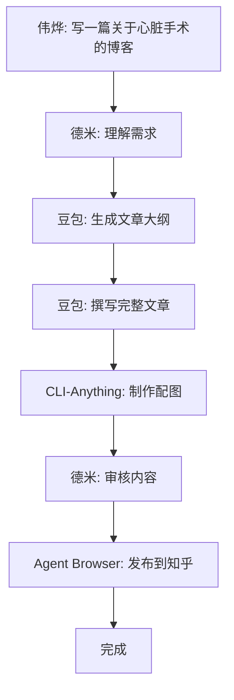
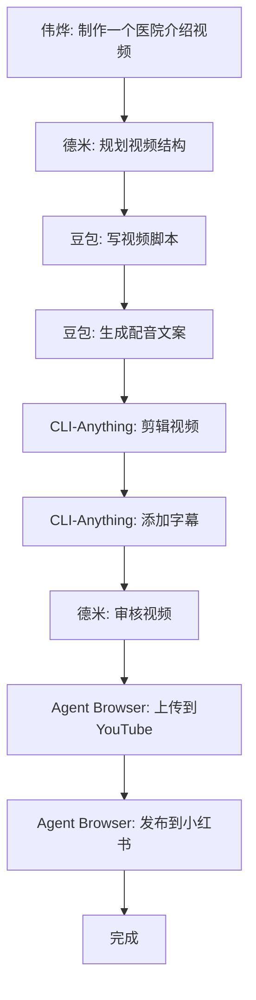

# AI团队工作流实战手册

> 创建时间：2026-03-15  
> 适用对象：大德米（本地Mac环境）  
> 版本：v1.0

---

## 团队角色与职责

```
伟烨（人类指挥官）
    ↓ 提出需求
德米（AI指挥官）
    ↓ 任务拆解与分配
├─→ 豆包妹妹（文案写手）
├─→ 内容生产Agent（CLI-Anything）
└─→ 内容分发Agent（Agent Browser）
```

### 各角色职责

| 角色 | 工具 | 职责 |
|------|------|------|
| **德米** | OpenClaw | 理解需求、拆解任务、分配工作、质量审核 |
| **豆包妹妹** | 豆包API | 生成文案、脚本、标题、标签 |
| **内容生产** | CLI-Anything | 制作图片、视频、PDF |
| **内容分发** | Agent Browser | 发布到各平台 |

---

## 标准工作流

### 工作流1：博客文章发布



**执行步骤：**

```bash
#!/bin/bash
# workflow_blog.sh

echo "=== 工作流：博客文章发布 ==="

# 步骤1: 生成文案（调用豆包API）
echo "[1/5] 生成文案..."
python3 << 'EOF'
import requests

response = requests.post("https://api.doubao.com/v1/chat", json={
    "messages": [
        {"role": "system", "content": "你是医疗旅游领域的专业写手"},
        {"role": "user", "content": "写一篇关于中国心脏手术费用的博客文章，面向美国患者"}
    ]
})
article = response.json()["choices"][0]["message"]["content"]
with open("./output/article.md", "w") as f:
    f.write(article)
print("文案已保存到 ./output/article.md")
EOF

# 步骤2: 制作配图
echo "[2/5] 制作配图..."
cli-anything gimp open ./assets/hospital_template.jpg
cli-anything gimp text add --content "Heart Surgery in China" --position center --font "Arial Bold" --size 48
cli-anything gimp export --format jpg --output ./output/cover.jpg

# 步骤3: 审核（德米人工审核）
echo "[3/5] 等待审核..."
echo "请审核 ./output/article.md 和 ./output/cover.jpg"
read -p "审核通过? (y/n): " APPROVED

if [ "$APPROVED" != "y" ]; then
    echo "审核未通过，终止流程"
    exit 1
fi

# 步骤4: 发布到知乎
echo "[4/5] 发布到知乎..."
agent-browser state load zhihu_auth.json
agent-browser open https://zhuanlan.zhihu.com/write
agent-browser fill @title_input "中国心脏手术费用指南 - 比美国节省80%"
agent-browser upload @cover_image ./output/cover.jpg

# 读取文章内容并填充
ARTICLE=$(cat ./output/article.md)
agent-browser fill @content_editor "$ARTICLE"

# 添加标签
agent-browser fill @tags_input "医疗旅游,心脏手术,中国医院"

# 发布
agent-browser click @publish_button
agent-browser wait --text "发布成功" --timeout 10000

echo "[5/5] ✅ 发布完成！"
```

---

### 工作流2：短视频制作与发布



**执行步骤：**

```bash
#!/bin/bash
# workflow_video.sh

echo "=== 工作流：短视频制作与发布 ==="

# 步骤1: 生成脚本
echo "[1/6] 生成视频脚本..."
python3 << 'EOF'
import requests

response = requests.post("https://api.doubao.com/v1/chat", json={
    "messages": [
        {"role": "system", "content": "你是短视频脚本写手，擅长15-60秒的医疗旅游推广视频"},
        {"role": "user", "content": "写一个30秒的医院介绍视频脚本，介绍北京协和医院"}
    ]
})
script = response.json()["choices"][0]["message"]["content"]
with open("./output/video_script.txt", "w") as f:
    f.write(script)
print("脚本已保存")
EOF

# 步骤2: 视频剪辑
echo "[2/6] 剪辑视频..."
cli-anything kdenlive project new --name "Hospital_Promo" --profile hd1080p30

# 导入素材
cli-anything kdenlive clip import ./assets/hospital_intro.mp4 --track video --position 0
cli-anything kdenlive clip import ./assets/doctor_interview.mp4 --track video --position 10
cli-anything kdenlive clip import ./assets/patient_testimonial.mp4 --track video --position 20

# 添加背景音乐
cli-anything kdenlive clip import ./assets/background_music.mp3 --track audio --position 0

# 步骤3: 添加字幕
echo "[3/6] 添加字幕..."
line_num=0
while IFS= read -r line; do
    start=$((3 + line_num * 8))
    cli-anything kdenlive subtitle add \
        --text "$line" \
        --start "0:00:$start" \
        --duration 6 \
        --style "white,bold,shadow,bottom"
    ((line_num++))
done < ./output/video_script.txt

# 添加转场
cli-anything kdenlive transition add --type dissolve --between 0,1 --duration 1
cli-anything kdenlive transition add --type dissolve --between 1,2 --duration 1

# 渲染
cli-anything kdenlive render --format mp4 --quality high --output ./output/video.mp4

# 步骤4: 审核
echo "[4/6] 等待视频审核..."
read -p "视频审核通过? (y/n): " APPROVED

if [ "$APPROVED" != "y" ]; then
    echo "审核未通过"
    exit 1
fi

# 步骤5: 上传到YouTube
echo "[5/6] 上传到YouTube..."
agent-browser state load youtube_auth.json
agent-browser open https://studio.youtube.com

agent-browser click @upload_button
agent-browser upload @file_input ./output/video.mp4

agent-browser fill @title "北京协和医院 - 国际患者指南"
agent-browser fill @description "$(cat ./output/video_script.txt)"
agent-browser fill @tags "医疗旅游,中国医院,协和医院,心脏手术"

agent-browser click @publish_button

# 步骤6: 发布到小红书
echo "[6/6] 发布到小红书..."
agent-browser state load xiaohongshu_auth.json
agent-browser open https://www.xiaohongshu.com

agent-browser click @publish
agent-browser upload @video_upload ./output/video.mp4
agent-browser fill @title "北京协和医院介绍"
agent-browser fill @content "$(head -3 ./output/video_script.txt)"
agent-browser click @publish_now

echo "✅ 视频发布完成！"
```

---

### 工作流3：多平台同步发布

**场景**：一篇文章同时发布到知乎、小红书、Twitter

```bash
#!/bin/bash
# workflow_multiplatform.sh

CONTENT_FILE=$1  # 文章文件路径
TITLE=$2

PLATFORMS=("zhihu" "xiaohongshu" "twitter")

for platform in "${PLATFORMS[@]}"; do
    echo "=== 发布到 $platform ==="
    
    # 加载认证
    agent-browser state load ${platform}_auth.json
    
    case $platform in
        "zhihu")
            agent-browser open https://zhuanlan.zhihu.com/write
            agent-browser fill @title_input "$TITLE"
            agent-browser fill @content_editor "$(cat $CONTENT_FILE)"
            agent-browser click @publish_button
            ;;
        "xiaohongshu")
            agent-browser open https://www.xiaohongshu.com
            agent-browser click @publish
            agent-browser fill @title "$TITLE"
            agent-browser fill @content "$(head -10 $CONTENT_FILE)"
            agent-browser click @publish_now
            ;;
        "twitter")
            agent-browser open https://twitter.com/compose/tweet
            # Twitter有字数限制，截取前280字符
            TWEET=$(head -c 250 $CONTENT_FILE)
            agent-browser fill @tweet_text "$TWEET... [阅读全文链接]"
            agent-browser click @tweet_button
            ;;
    esac
    
    agent-browser wait 3000  # 等待3秒
done

echo "✅ 多平台发布完成！"
```

---

## 常用任务速查

### 任务1：批量制作医院介绍卡片

```bash
#!/bin/bash
# batch_hospital_cards.sh

HOSPITALS=("协和医院" "阜外医院" "天坛医院" "积水潭医院")

for hospital in "${HOSPITALS[@]}"; do
    echo "制作 $hospital 介绍卡片..."
    
    # 生成文案
    python3 generate_hospital_intro.py --name "$hospital" --output "./output/${hospital}_intro.txt"
    
    # 制作图片
    cli-anything gimp open ./templates/hospital_card_template.jpg
    cli-anything gimp text add --content "$hospital" --position "top-center" --font "Arial Bold" --size 36
    cli-anything gimp text add --content "$(cat ./output/${hospital}_intro.txt)" --position "center" --font "Arial" --size 18
    cli-anything gimp export --format jpg --output "./output/${hospital}_card.jpg"
    cli-anything gimp close
done
```

### 任务2：监控竞品动态

```bash
#!/bin/bash
# monitor_competitors.sh

COMPETITORS=("competitor1.com" "competitor2.com")

for competitor in "${COMPETITORS[@]}"; do
    echo "检查 $competitor..."
    
    agent-browser open "https://$competitor/blog"
    
    # 获取最新文章标题
    LATEST_TITLE=$(agent-browser get text "article:first-child h2")
    
    # 保存到监控日志
    echo "$(date): $competitor - $LATEST_TITLE" >> ./logs/competitor_monitor.log
done
```

### 任务3：定时内容发布

```bash
#!/bin/bash
# scheduled_publish.sh
# 添加到crontab: 0 10 * * * /path/to/scheduled_publish.sh

CONTENT_DIR="./scheduled_content"
TODAY=$(date +%Y%m%d)

# 查找今天的内容
TODAY_CONTENT=$(find $CONTENT_DIR -name "${TODAY}_*.md" | head -1)

if [ -n "$TODAY_CONTENT" ]; then
    echo "发布今日内容: $TODAY_CONTENT"
    
    TITLE=$(head -1 $TODAY_CONTENT | sed 's/# //')
    
    # 发布到知乎
    ./publish_article.sh zhihu "$TITLE" "$TODAY_CONTENT"
    
    # 移动已发布内容
    mv $TODAY_CONTENT ./published/
else
    echo "今天没有待发布内容"
fi
```

---

## 故障处理流程

### 场景1：发布失败

```bash
# 重试机制
MAX_RETRIES=3
RETRY_COUNT=0

while [ $RETRY_COUNT -lt $MAX_RETRIES ]; do
    if agent-browser click @publish_button; then
        echo "发布成功"
        break
    else
        echo "发布失败，重试..."
        ((RETRY_COUNT++))
        sleep 5
    fi
done

if [ $RETRY_COUNT -eq $MAX_RETRIES ]; then
    echo "发布失败，记录到错误日志"
    echo "$(date): 发布失败 - $TITLE" >> ./logs/publish_errors.log
fi
```

### 场景2：登录状态失效

```bash
# 检查登录状态
agent-browser open https://www.zhihu.com
CURRENT_URL=$(agent-browser get url)

if [[ $CURRENT_URL == *"signin"* ]]; then
    echo "登录状态失效，需要重新登录"
    
    # 发送通知给伟烨
    curl -X POST "https://api.notify.com/alert" \
        -d "message=知乎登录状态失效，请重新登录"
    
    # 标记任务失败
    exit 1
fi
```

---

## 文件组织规范

```
workspace/
├── workflows/              # 工作流脚本
│   ├── workflow_blog.sh
│   ├── workflow_video.sh
│   └── workflow_multiplatform.sh
├── output/                 # 输出文件
│   ├── articles/
│   ├── videos/
│   └── images/
├── assets/                 # 素材文件
│   ├── templates/
│   ├── music/
│   └── footage/
├── auth/                   # 认证文件（不要提交到git）
│   ├── zhihu_auth.json
│   ├── xiaohongshu_auth.json
│   └── youtube_auth.json
├── logs/                   # 日志文件
│   ├── publish.log
│   └── errors.log
└── scheduled_content/      # 待发布内容
```

---

## 安全注意事项

1. **认证文件保护**
   - 所有`*_auth.json`文件加入`.gitignore`
   - 定期更新登录状态
   - 不要分享认证文件

2. **API密钥管理**
   - 使用环境变量存储API Key
   - 定期轮换密钥

3. **操作日志记录**
   - 所有发布操作记录日志
   - 错误信息详细记录

---

## 参考文档

- **CLI-Anything详细运用指南**: `./CLI-Anything详细运用指南.md`
- **Agent Browser完整命令手册**: `./Agent-Browser完整命令手册.md`
- **AI团队架构方案**: `../03-能力档案/AI团队架构方案.md`

---

*创建者：德米*  
*最后更新：2026-03-15*
